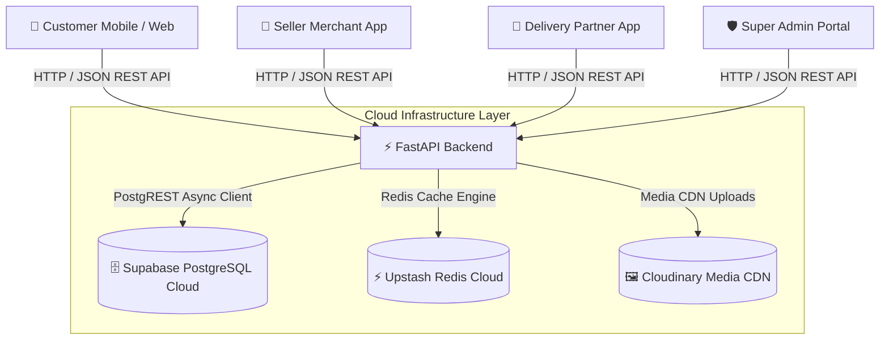

<div align="center">

# ⚡ GRAB IT — Hyper-Local Quick-Commerce Platform

> **Local Shopping • 4 Unified Portals • Real-Time Order Tracking • Cloud Native**

[](https://grabit-main.vercel.app)
[](https://grabit-api.vercel.app/docs)
[](https://react.dev/)
[](https://supabase.com/)
[](LICENSE)

---

### 🌐 [Explore Live Platform](https://grabit-main.vercel.app) • [API Swagger Documentation](https://grabit-api.vercel.app/docs)

</div>

---

## 📖 Table of Contents
- [✨ Key Platform Features](#-key-platform-features)
- [🏛️ Architecture & System Design](#️-architecture--system-design)
- [📱 4-Portal Ecosystem Breakdown](#--4-portal-ecosystem-breakdown)
- [🛠️ Tech Stack & Cloud Services](#️-tech-stack--cloud-services)
- [🔌 API Endpoints Reference](#-api-endpoints-reference)
- [⚡ Quick Start & Local Setup](#-quick-start--local-setup)
- [👥 Core Engineering Team](#-core-engineering-team)

---

## ✨ Key Platform Features

- 📱 **Mobile-First Experience**: Touch-optimized interface, custom bottom bar navigation, and Apple-paced splash screen.
- 🏪 **4 Unified Portals**: Single codebase serving Customer Storefront, Seller Inventory Hub, Delivery Partner Rider App, and Super Admin Management.
- ⚡ **Hyper-Local 5 KM Radius Validation**: Real-time geolocation validation restricting instant deliveries within an operational 5 km boundary.
- 🛒 **Dynamic Cart & Coupon Engine**: Live subtotal calculations, product deduplication, and coupon validation (`GRABIT50`, `WELCOME100`, `FREESHIP`).
- 📍 **In-App Mobile Modals**: Completely responsive address picker, map location confirmation, and inline delete overlays.
- 🖼️ **Cloud Media Storage**: High-speed CDN delivery via Cloudinary with dynamic image transformations.
- 🔒 **Unified Auth Engine**: Phone-based OTP verification with JWT token generation and role-based access control (RBAC).

---

## 🏛️ Architecture & System Design



---

## 📱 4-Portal Ecosystem Breakdown

| Portal | Target Audience | Primary Capabilities |
| :--- | :--- | :--- |
| **🛍️ Customer Storefront** | End Users / Shoppers | Product discovery, category filtering, cart management, address selector, promo coupons, live order tracking. |
| **🏪 Seller Hub** | Local Merchants / Stores | Product catalog CRUD, stock/availability toggles, image uploads, incoming order acceptance, earnings analytics. |
| **🛵 Delivery Partner App** | Riders / Delivery Agents | Available order board, route mapping, order pickup/drop updates, KYC verification, payout tracking. |
| **🛡️ Super Admin Portal** | Platform Managers | User management, store approval workflows, platform-wide analytics, system configuration, revenue metrics. |

---

## 🛠️ Tech Stack & Cloud Services

```text
┌─────────────────────────────────────────────────────────────────────────┐
│                           GRABIT TECH STACK                             │
├───────────────────┬─────────────────────────────────────────────────────┤
│ Frontend          │ React 19, Vite 8, React Router v7, Lucide Icons,     │
│                   │ Recharts, Leaflet Interactive Maps                  │
├───────────────────┼─────────────────────────────────────────────────────┤
│ Backend API       │ Python 3.10+, FastAPI, Uvicorn, Pydantic v2, PyJWT │
├───────────────────┼─────────────────────────────────────────────────────┤
│ Database & Cache  │ Supabase PostgreSQL Cloud, Upstash Redis            │
├───────────────────┼─────────────────────────────────────────────────────┤
│ Media Storage     │ Cloudinary Global Asset CDN                         │
├───────────────────┼─────────────────────────────────────────────────────┤
│ Hosting & Edge    │ Vercel Serverless & Edge Network                    │
└───────────────────┴─────────────────────────────────────────────────────┘
```

---

## 🔌 API Endpoints Reference

### 🔐 Authentication
* `POST /api/auth/send-otp` — Send verification OTP code to mobile number
* `POST /api/auth/verify` — Verify OTP code and issue JWT access token

### 📦 Product & Category Operations
* `GET /api/products` — Retrieve all active products with pagination & filtering
* `GET /api/products/{id}` — Fetch specific product details & stock status
* `POST /api/products` — Create new product listing (Seller / Admin)
* `PATCH /api/products/{id}` — Update price, stock, or details (Seller / Admin)
* `DELETE /api/products/{id}` — De-list product from catalog

### 🛒 Shopping Cart & Orders
* `GET /api/cart` — Fetch current user's synced cart state
* `POST /api/cart` — Add product item to cart
* `POST /api/orders` — Place new order (with 5 km radius check)
* `GET /api/orders` — Retrieve user order history
* `GET /api/orders/{id}` — Live order status timeline & tracking

### 🖼️ Media Management
* `POST /api/uploads/image` — Direct upload of product/profile image to Cloudinary

---

## ⚡ Quick Start & Local Setup

### 📋 Prerequisites
* **Node.js** v18+ & `npm`
* **Python** v3.10+ & `pip`

### 1️⃣ Clone the Repository
```bash
git clone https://github.com/GrabIt-Main/KSS-GRAB-IT.git
cd Grabit
```

### 2️⃣ Start Backend Service (FastAPI)
```bash
cd backend
python -m venv venv

# Windows:
.\venv\Scripts\Activate.ps1
# Mac/Linux:
source venv/bin/activate

pip install -r requirements.txt
uvicorn app.main:app --reload --port 8000
```
> Backend API Swagger docs will be available at `http://localhost:8000/docs`

### 3️⃣ Start Frontend App (Vite + React)
```bash
# Open a new terminal in Grabit directory
cd frontend
npm install
npm run dev
```
> Frontend Application will be running at `http://localhost:5173`


## 👥 Core Engineering Team

| Name | Role | Primary Domain |
| :--- | :--- | :--- |
| **Jason Kenneth N** | **Team Lead** | Platform Architecture & Super Admin Portal |
| **Akash S B** | **Full-Stack Engineer** | End-to-End Customer Storefront & Mobile UX |
| **Priyanka Kushwah** | **Full-Stack Engineer** | Seller Merchant Hub & Product Management |
| **I Thabeethal Asnath** | **Full-Stack Engineer** | Delivery Partner App & Logistics Lifecycle |

---

<div align="center">
  <sub><b>GrabIt</b> • Hyper-Local Quick Commerce Platform</sub>
</div>
